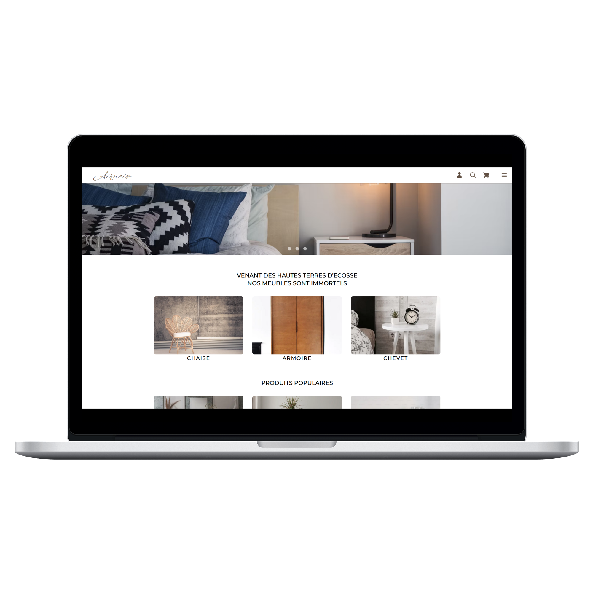

# Airneis Project



## Context
ÀIRNEIS ("furniture" in Scottish Gaelic) is a Scottish company that resells furniture designed by Scottish designers.
They have expressed their desire to move into the digital age and wish to create their own e-commerce solution to reach
an international clientele and expend the one they already have locally.
The final deliverable required is a mobile-first e-commerce website and a mobile application, with a web backoffice to
manage the content, an integrated content and a secure and maintainable payment system over time.

## Our team
<table>
  <tr>
    <td>Tom Ollivier</td>
    <td>Hugo Vaillant</td>
    <td>Charlotte Waegeneire</td>
    <td>William Wautrin</td>
 </tr>
  <tr>
    <td>Web developer</td>
    <td>Web developer</td>
    <td>Web developer</td>
    <td>Web developer</td>
  </tr>
</table>

## Important links:
<ul>
  <li><a href="https://website-pi-lac.vercel.app">Production link</a></li>
  <li><a href="https://www.figma.com/file/UvXFVxT44gA9Gsh4w8DoJf/Site-web-(responsive-desktop)?type=design&t=L3FFPfcJescZsO4w-1">Figma</a></li>
</ul>

## `.env` setup
```dotenv
HOST_PATH=

# Your DB
DB_CONNECTION_HOST=
DB_CONNECTION_USER=
DB_CONNECTION_PWD=
DB_CONNECTION_DB=

# Hash password
SECURITY_PASSWORD_PEPPER=
SECURITY_JWT_SECRET=

# SendGrid
KEY_SEND_GRID=
MAIL_SEND_GRID=

# Stripe
SK_STRIPE=
```

## How to install the project
- Clone the project;
- Run the command `npm install` to install all the dependencies;
- Set up the .env file;
- Run the `npx knex --esm migrate:latest` to create your database tables. Make sure your postgreSQL database is empty;
- Run the command `npm run build` to build the website;
- Run the command `npm run start` to run the website;
- The terminal will tell you the url based on the host you indicated in your .env file. Enjoy !